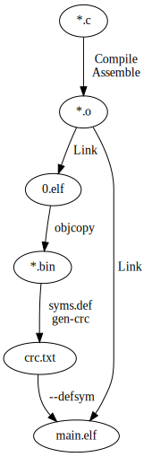

This C program calculates a 16-bit
[CRC](https://en.wikipedia.org/wiki/Cyclic_redundancy_check)
over the flash ROM of an
[AVR](https://en.wikipedia.org/wiki/AVR_microcontrollers)
and checks its correctness.

The correct CRC is calculated by `gen-crc`, a small companion
program that runs on the PC.
The CRC is then shipped to the AVR program via a symbol.
That way:

- No custom linker script is required.
- No patching of binary files is required.

## Makefile

The image on the right shows the build process according to the `Makefile`.
The build steps are:

<dl>
<dt><tt>0.elf</tt>
<dd>A tentative ELF file is created where symbol <tt>crc.value</tt> is set
to an arbitrary value by means of <tt>--defsym crc.value=&lt;val&gt;</tt>.

<dt><tt>*.bin</tt>
<dd><tt>avr-objcopy</tt> writes binary files
<tt>text.bin</tt>, <tt>data.bin</tt> and <tt>rodata.bin</tt> which are
the contents of the <tt>.text</tt>, <tt>.data</tt> and <tt>.rodata</tt>
<a href="https://avrdudes.github.io/avr-libc/avr-libc-user-manual/mem_sections.html#sec_ld_script"
> output sections</a> of <tt>0.elf</tt>, respectively.

<dt><tt>syms.def</tt>
<dd>An auto-generated C file that is included by <tt>gen-crc.c</tt>.
It ships values of symbols from <tt>0.elf</tt> like for
<tt>__vectors</tt>, <tt>__data_load_end</tt>, etc.

<dt><tt>crc.txt</tt>
<dd>This is an ASCII file generated by running <tt>gen-crc</tt>.
It contains the 16-bit CRC of the AVR program, except for
<tt>crc_value</tt>, which has been skipped.

<dt><tt>main.elf</tt>
<dd>This is the final AVR application. It is linked exactly in the same
way like <tt>0.elf</tt>, i.e. it uses the same object files and options, etc.
The only difference is that it defines symbol <tt>crc.value</tt>
to the correct value:
<pre>
$ avr-gcc ... -o main.elf -Wl,--defsym,crc.value=$(cat crc.txt)
</pre>

</dl>

The generated AVR program can be simulated with the
[AVRtest](https://github.com/sprintersb/atest) simulator.
For details, see
```
$ make run
```
